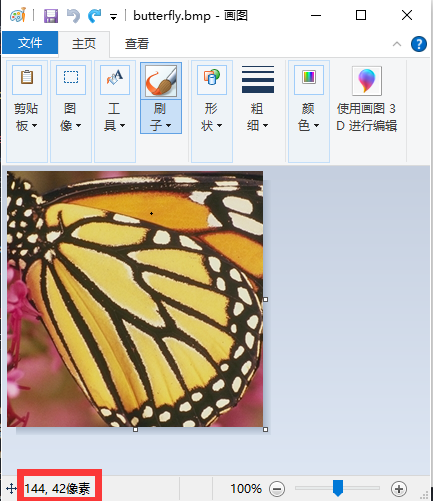
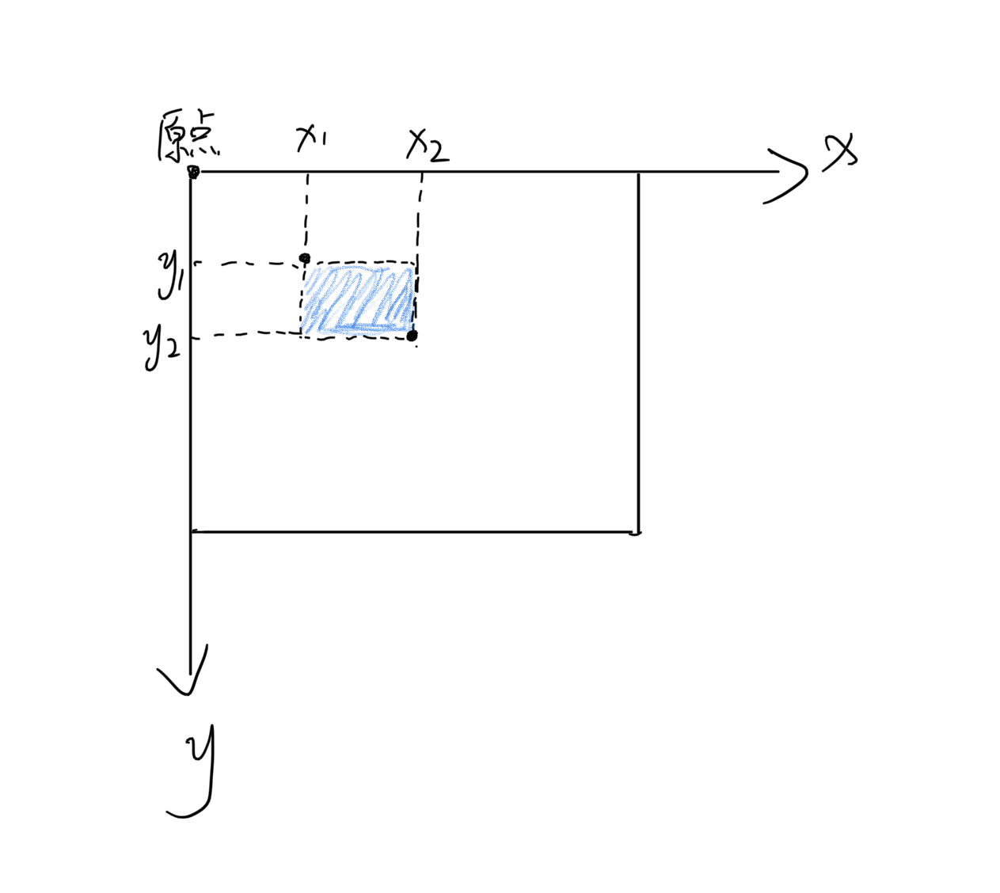

# ImageToolsGUI

本项目是一个采用PyQt5框架，以及PIL库制作的一个可视化图像处理小工具，主要用于帮助论文制图。界面与功能如图：


## 环境依赖

由于本项目采用Python相关框架开发，请确保本地满足以下环境与扩展包

* Python>=3.6
* pillow
* PyQt5

如果不想使用python框架运行，本项目也已经打包成可执行文件，请从Release下载使用

其中压缩包版解压后体积更大，但是启动速度较快；单文件版体积小但是启动速度较慢，请根据自身需求选择下载。

## 运行

直接运行项目中的StartWindows.py即可

```
python StartWindows.py
```

如果使用Release中预打包的程序，则直接运行exe文件即可

## 功能使用方法

### 1.像素定位

本功能因作者能力有限暂未实现，如果相对图片像素进行定位可使用Windows自带画图打开图片



### 2.图片筛选

本功能最多支持6组图像同时查看：

1. 首先选择需要对比的图片文件夹（请确保文件夹中只包含图片，并且保证每个文件夹图片数量相同）

2. 点击“开始筛选”即可进入对比筛选页面，左下角显示文件名

   

### 3.图片裁剪

本功能将会根据给定裁剪坐标裁剪给定图片或者给定文件夹的所有图片

这里规定裁剪坐标格式为：x1,y1,x2,y2（以英文逗号间隔）


如图所示以图像的左上角为原点建立坐标系，蓝色区域为待剪裁图像块，左上角坐标为x1,y1；右下角坐标为x2,y2

如果使用windows自带画图工具可以直接获取像素坐标，其格式也是x,y



### 4.绘制定位框

本功能将根据给定坐标绘制矩形方框


如果勾选“同时保存绘制区域图像块”，将会在保存处理结果时，额外截取给定坐标的图像块进行保存。

### 5.重采样

本功能可以对给定文件夹中图像进行批量重采样

采样倍率输入框可以支持一次性多倍数重采样，不同倍数以英文逗号间隔


## 注意

* 本项目只为个人使用方便，因此并未做过多数据校验与异常处理，请严格按照说明使用。
* 选择文件时请确保是常见图像类型（.jpg .jpeg .png .bmp）
* 选择文件夹时请确保文件夹均为图像文件
* 保存文件均放置在本项目的workdir文件夹
  * 项目启动时会自动检查该文件夹
  * 如不存在会自动建立
  * 请不要在运行过程中删除该文件夹以免保存结果失败